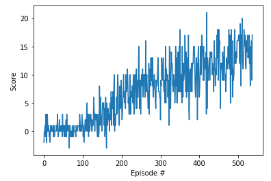
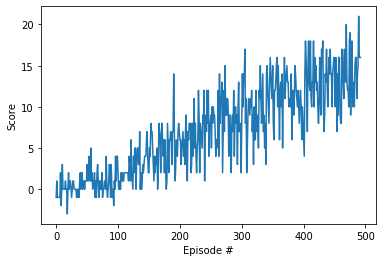
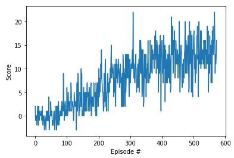

# Navigation Project Report

## Frameworks description

* **DQN**:
* **Double DQN**:
* **Dueling Double DQN**:

## Implementation structure

The project is structured as follows:

* model.py : this file defines the model classes that contain the deep learning models' structures used to train the agents. It implements both the dqn and double dqn model structure. It uses the same layer configuration as used by DeepMind for their Atari game training.
* agent.py : this file defines the agent class that contains the functions used to train the agent. It allows to train the agent using the DQN, DOUBLE DQN or DUELING DQN frameworks. It implements the fixed Q targets and random experience replay methods proprosed by DeepMind. 
* .ipynb files : Those files set up the environment and allow to train and watch the trained agents perform for each frameworl.
* .pth files: Those files saved the deep learning model weights in order to use a trained agent at any time without the need to retrain.
    
## Hyperparameters

Uniform parameters where used for each framework in order to compare them. They are recorded in the table below.

  | Hyperparameter                      | Value |
  | ----------------------------------- | ----- |
  | Number of episodes                  | 2000  |
  | Average score to finish training    | 13.0  |
  | Epsilon start                       | 1.0   |
  | Epsilon minimum                     | 0.01  |
  | Epsilon decay                       | 0.995 |
  | Replay buffer size                  | 1e5   |
  | Batch size                          | 64    |
  | Gamma                               | 0.99  |
  | Tau                                 | 1e-3  |
  | Learning rate                       | 5e-4  |
  | update interval                     | 4     |

Note that the maximum timestep parameter was not used as the environement stops automatically after a certain numbers of timesteps. The training will stop when the maximum number of episodes is reached or when the average score reaches 13.0.

## Results

| DQN                                        | Double DQN                         | Dueling DQN                                         |
| ------------------------------------------ | ---------------------------------- | --------------------------------------------------- |
|               |       |           |

The Double DQN is the fastest to converge at 493 episodes. The DQN is second at 537 episodes and the Dueling DQN comes last at 573 episodes.

## Further improvements

The Double DQN seems the most adapted for this problem, however more investigation should be performed by trying to train with different hyperparameters.

The performance of the trained agent is quite unstable, as it can be observed by the noisy score graphs. This result in a trained agent often being stuck and being unable to collect enough points. Longer training and/or tuning of the hyperparameter is recommended to smoothen the agent's performance.
