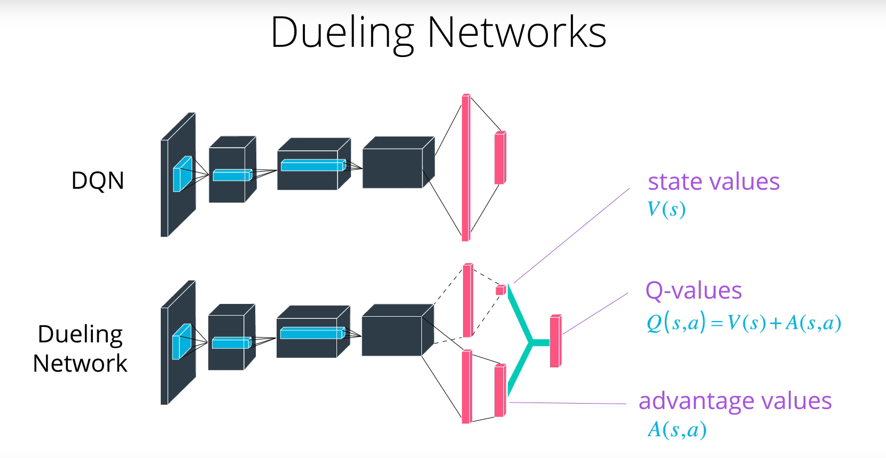

# Navigation Project Report

## Frameworks description

* **DQN**: DQN or Deep Q-Network is a framework that uses a deep learning model as a in order to generate a Q value function. It takes the environment's state vector as input and output a vector of Q values for each possible action in the environment. The network is designed to produce a Q value for every possible action at every training step. It consists of two convolution layers followed by two fully connected layers. The model's weights evolve at each training step in order to converge towards a function modeling the optimal policy for the problem at hand. In order to deal with instability or divergence of the network weights, this framework is supported by the concepts of **Experience replay** and **Fixed Q-Targets** developed by DeepMind. 
* **Double DQN**: Double DQN reduces chance of instability due to overestimation of Q values. The overestimation appears when the Q values approximation in noisy, and as the implementation is designed to pick the maximum Q value, a noisy set will always result in an overestimation. To solves this problem, a double DQN framework evaluates qtargets using the DQN of both the local and target qnetworks when updated the target qnetwork. The Q values will then be more likely to increase when both the target and local network are in agreement over which action is best.
* **Dueling Double DQN**: This framework slighlty modifies the DQN model architecture to separate the network into two streams when reaching the fully connected layers stage. One stream estimates the state values function V(s) while the other stream estimates the advantage value function A(s,a). The motivation for this change is that states do not generally vary across actions and it is therefore a good idea to separate them as they can be considered independent. The figure below shows the difference in structure between a DQN and a Dueling DQN network.

  

## Implementation structure

The project is structured as follows:

* model.py : this file defines the model classes that contain the deep learning models' structures used to train the agents. It implements both the dqn and double dqn model structure. It uses the same layer configuration as used by DeepMind for their Atari game training.
* agent.py : this file defines the agent class that contains the functions used to train the agent. It allows to train the agent using the **DQN**, **Double DQN** or **Dueling DQN** frameworks. It implements the **Fixed Q targets** and **Experience replay** methods proprosed by DeepMind. 
* .ipynb files : Those files set up the environment and allow to train and watch the trained agents perform for each frameworl.
* .pth files: Those files saved the deep learning model weights in order to use a trained agent at any time without the need to retrain.
    
## Hyperparameters

Uniform parameters where used for each framework in order to compare them. They are recorded in the table below.

  | Hyperparameter                      | Value |
  | ----------------------------------- | ----- |
  | Number of episodes                  | 2000  |
  | Average score to finish training    | 13.0  |
  | Epsilon start                       | 1.0   |
  | Epsilon minimum                     | 0.01  |
  | Epsilon decay                       | 0.995 |
  | Replay buffer size                  | 1e5   |
  | Batch size                          | 64    |
  | Gamma                               | 0.99  |
  | Tau                                 | 1e-3  |
  | Learning rate                       | 5e-4  |
  | update interval                     | 4     |

Note that the maximum timestep parameter was not used as the environement stops automatically after a certain numbers of timesteps. The training will stop when the maximum number of episodes is reached or when the average score reaches 13.0.

## Results

| DQN                                        | Double DQN                         | Dueling DQN                                         |
| ------------------------------------------ | ---------------------------------- | --------------------------------------------------- |
|               |       |           |

The Double DQN is the fastest to converge at 493 episodes. The DQN is second at 537 episodes and the Dueling DQN comes last at 573 episodes.

## Discussion and Further improvements

The Double DQN seems the most adapted for this problem, however more investigation should be performed by trying to train with different hyperparameters.

The performance of the trained agent is quite unstable, as it can be observed by the noisy score graphs. This result in a trained agent often being stuck and being unable to collect enough points. Longer training and/or tuning of the hyperparameter is recommended to smoothen the agent's performance.

Lastly, the dueling DQN did not perform as well as expected, which could indicate that the assumption that states do not generally vary across actions is not valid for this environment.
