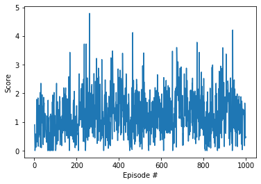

# Continuous Control Project Report

## Framework description

* **DDPG**: DDPG or Deep Deterministic Policy Gradients is a model independent and off-policy actor-critic algorithm that uses deep neural networks to learn policies in high-dimensional, continuous action and state spaces. It consists of two networks. The Actor network is a policy based model that will take the state as input and directly output a policy, as in the optimal stochastic action probability distribution associated to that state. The Critic model is a value based model that has a similar structure to the **DQN framework** it will take the state as input and construct a Q valued function for the action space for that state. In order to deal with instability or divergence of the network weights, this framework is supported by the concepts of **Experience replay** and **Fixed Q-Targets** (by using a local and target network) developed by DeepMind.
* **OU Noise**: OU Noise, or Ornstein-Uhlenbeck Noise refers to the introduction of a Gaussian noise when picking an action in the continuous action space during the training of the agent. In practice, this introduced randomness in the action choice has been seen to improve the learning rate of the agent.

You can find below the DDPG algorithm implementation.

 
## Implementation structure

The project is structured as follows:

* model.py : this file defines the model classes that contain the deep learning models' structures used to train the agents. It consists of 1 fully connected layer followed by a normalisation layer and then 2 fully connected layers. Apart from the normalised layer, it has the same structure as the one used to solve the OpenAI gym Pendulum environment.
* ddpg_agent.py : this file defines the agent class that contains the functions used to train the agent.
* .ipynb files : Those files set up the environment and allow to train and watch the trained agents perform.
* .pth files: Those files saved the deep learning model weights in order to use a trained agent at any time without the need to retrain.
    
## Hyperparameters

Three different sets of hyperparameters were used to train the agents. They are reported in Table 1 to 3 below. The next section will compare the difference in performance between the three sets of parameters. The parameters in bold are the one that were changed from the previous set.

<ins>Table 1: Training parameters set 1.</ins>

  | Hyperparameter                      | Value |
  | ----------------------------------- | ----- |
  | Number of episodes                  | 1000  |
  | Average score to finish training    | 30.0  |
  | Max timesteps                       | 1000  |
  | Replay Buffer size                  | 1e5   |
  | Batch size                          | 128   |
  | Gamma                               | 0.99  |
  | Tau                                 | 1e-3  |
  | Learning rate Actor                 | 1e-4  |
  | Learning rate Critic                | 1e-3  |
  | Weight decay                     	| 0     |
  | Actor: fc1 size       		| 400   |
  | Actor: fc2 size       		| 300   |
  | Critic: fc1 size       		| 400   |
  | Critic: fc2 size       		| 300   |
  | Mu ou                               | 0     |
  | Theta ou                            | 0.15  |
  | Sigma ou                            | 0.2   |
  | Learn every_t                       | 1  	|
  | Learn num                           | 1	|

<ins>Table 2: Training parameters set 2.</ins>

  | Hyperparameter                      | Value |
  | ----------------------------------- | ----- |
  | **Number of episodes**              | 2000  |
  | Average score to finish training    | 30.0  |
  | Max timesteps                       | 1000  |
  | Replay Buffer size                  | 1e5   |
  | Batch size                          | 128   |
  | Gamma                               | 0.99  |
  | Tau                                 | 1e-3  |
  | **Learning rate Actor**             | 2e-4  |
  | **Learning rate Critic**            | 2e-4  |
  | Weight decay                     	| 0     |
  | **Actor: fc1 size**       		| 128   |
  | **Actor: fc2 size**       		| 128   |
  | **Critic: fc1 size**       		| 128   |
  | **Critic: fc2 size**       		| 128   |
  | Mu ou                               | 0     |
  | Theta ou                            | 0.15  |
  | Sigma ou                            | 0.2   |
  | **Learn every t**                   | 20  	|
  | **Learn num**                       | 10	|

<ins>Table 3: Training parameters set 3.</ins>

  | Hyperparameter                      | Value |
  | ----------------------------------- | ----- |
  | Number of episodes                  | 1000  |
  | Average score to finish training    | 30.0  |
  | Max timesteps                       | 1000  |
  | Replay Buffer size                  | 1e5   |
  | Batch size                          | 128   |
  | Gamma                               | 0.99  |
  | Tau                                 | 1e-3  |
  | Learning rate Actor                 | 1e-4  |
  | Learning rate Critic                | 1e-3  |
  | Weight decay                     	| 0     |
  | Actor: fc1 size       		| 128   |
  | Actor: fc2 size       		| 128   |
  | Critic: fc1 size       		| 128   |
  | Critic: fc2 size       		| 128   |
  | Mu ou                               | 0     |
  | Theta ou                            | 0.15  |
  | **Sigma_ou**                        | 0.1   |
  | Learn every t                       | 20  	|
  | Learn num                           | 10	|

The training will stop when the maximum number of episodes is reached or when the average score reaches 30.0.

## Results and Discussion

| Hyperparameters set 1                                        | Hyperparameters set 2                         | Hyperparameters set 3                                         |
| ------------------------------------------ | ---------------------------------- | --------------------------------------------------- |
|               |       |           |

The first set of parameter finished training at 1000 episodes with a mean score of 1.0, the second set reached a mean score of 26.0 after 2000 episodes and the third set achieved a score of 30.0 after 374 episodes, solving the environment. 

The first set of parameters produced a very unstable performance, and the agent was unable to learn. In addition, the training was very slow as the agent was prompted to learn at every time step. With the second sets of parameters, the agent was able to increase its mean score over time. This was achieved thanks to the uniformisation of the learning rates of the actor and critic, as well as several changes in the deep learning model structure. Firstly, the nodes in the fully connected layers in the model was uniformised and reduced to 128. Secondly, a normalisation layer was introduced after the first fully connected layer. Thirdly, the clip_grad_norm_ function was introduced when training the critic network. Lastly, the parameters Learn_every_t and Learn_num where introduced, which allows the agent to only learn every X timesteps for Y number of times, respectively. This improved the performance of the algorithm as a single episode took a lot less time to complete, and also improved the learning stability of the agent.

However, the mean score still presented the same amount of noise as for set 1. It also was unable to reach a mean score past 26 points. Increasing the number of training episodes did not improve performance, and increasing the number of timesteps resulted in worse performance. It was hypothesised that the worse performance was due to the noise introduced to the actions in order to improve training. The Sigma OU parameter was halved in order to reduce by half the noise's magnitude, which resulted in a more stable learning performance. Sure enough, the noise dramatically reduced and learning performance increased between episodes 0 and 150. It then slightly increased between episodes 150 and 450. The noise was then again very low for the last 24 episodes. This allowed the agent to clear the required score.

It is to note that the agents performs consistently above 30 when watching the trained agent, as the extra 100 episodes of learning and the OU noise being disabled greatly improve its performance.

## Further improvements

Further improvements could be taken to increase the learning performance, such as reintroducing a larger size for the first fully connected layer of the models. Additionally, further investigation of the tuning parameters could be conducted to achieve more stable and faster learning rate. Lastly, it would be interesting to reintroduce the concept of the exploration rate with the parameter epsilon. Epsilon would directly affect the magnitude of noise added to the action and will gradually decrease to 0 as training progresses. This would maximise the beneficial effect of noise during the early phase of training where the agent needs to explore and eliminate the adverse effect of noise where the agent is nearly trained and close to achieving its goal.
