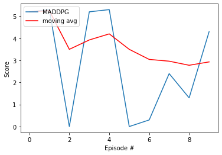

# Multi-Agent Collaboration Project Report

## Framework description

* **DDPG**: DDPG or Deep Deterministic Policy Gradients is a model independent and off-policy actor-critic algorithm that uses deep neural networks to learn policies in high-dimensional, continuous action and state spaces. It consists of two networks. The Actor network is a policy based model that will take the state as input and directly output a policy, as in the optimal stochastic action probability distribution associated to that state. The Critic model is a value based model that has a similar structure to the **DQN framework** it will take the state as input and construct a Q valued function for the action space for that state. In order to deal with instability or divergence of the network weights, this framework is supported by the concepts of **Experience replay** and **Fixed Q-Targets** (by using a local and target network) developed by DeepMind.
* **MADDPG**: MADDPG or Multi Agent Deep Deterministic Policy Gradients is an implementation of the DDPG algorithm that is more suited to multi-agent systems. In incorporates a centralised learning structure (as seen in Figure 1) such that all of the Observation and Action spaces are available to the Neural Network during training in order to construct the Q-table (Critic network) and policy (Actor network). However each agent gets its own trained Actor and Critic networks, which allows for decentralised execution. In addition, this implementation introduces the concepts of **Exploration rate** and **Weight savings checks** in order to maximise the training performance.
* **Exploration rate**: The exploration rate parameter epsilon is first introduced with classical reinforcement learning, and implemented within the **DQN framework** developed by DeepMind. Here, it is reintroduced as a way to scale the amount of **OU Noise** applied to the selected actions. This allow for the agents to start learning by exploring their environment. Epsilon starts off very large, which introduces a lot of noise in the actions taken by the agents. Epsilon then monotonously decreases to reach 0 after a certain number of episodes. At epsilon value of 0, no noise is applied to the action space anymore.
* **OU Noise**: OU Noise, or Ornstein-Uhlenbeck Noise refers to the introduction of a Gaussian noise when picking an action in the continuous action space during the training of the agent. In practice, this introduced randomness in the action choice has been seen to improve the learning rate of the agent.
* **Weight savings checks**: It will be shown in the next sections that this framework is rather unstable and that performance starts to break down after a certain number of episodes. To counteract this and still achieve the best possible performance after learning, a check is introduced that will only save network weights that achieve the highest score. Once the performance starts to degrade, the weights will not be saved any longer.

<ins>Figure 1: MADDPG structure.</ins>

 

<ins>Figure 2: MADDPG algorithm.</ins>

 

## Implementation structure

The project is structured as follows:

* model.py : this file defines the model classes that contain the deep learning models' structures used to train the agents. It consists of 1 fully connected layer followed by a normalisation layer and then 2 fully connected layers. Apart from the normalised layer, it has the same structure as the one used to solve the OpenAI gym Pendulum environment.
* maddpg_agent.py : this file defines the agent class that contains the functions used to train the agent.
* .ipynb files : Those files set up the environment and allow to train and watch the trained agents perform.
* .pth files: Those files saved the deep learning model weights in order to use a trained agent at any time without the need to retrain.
    
## Hyperparameters

Two different sets of hyperparameters were used to train the agents. They are reported in Table 1 and 2 below. The next section will compare the difference in performance between the two sets of parameters. The parameters in bold are the one that were changed from the previous set.

<ins>Table 1: Training parameters set 1 "turtle".</ins>

  | Hyperparameter                      | Value |
  | ----------------------------------- | ----- |
  | Number of episodes                  | 2000  |
  | Average score to finish training    | 0.5   |
  | Max timesteps                       | 1000  |
  | Replay Buffer size                  | 1e5   |
  | Batch size                          | 128   |
  | Gamma                               | 0.99  |
  | Tau                                 | 8e-3  |
  | Learning rate Actor                 | 1e-3  |
  | Learning rate Critic                | 1e-3  |
  | Weight decay                     	| 0     |
  | Actor: fc1 size       		| 256   |
  | Actor: fc2 size       		| 128   |
  | Critic: fc1 size       		| 256   |
  | Critic: fc2 size       		| 128   |
  | Mu ou                               | 0     |
  | Theta ou                            | 0.15  |
  | Sigma ou                            | 0.2   |
  | Learn every t                       | 1  	|
  | Learn num                           | 5	|
  | Epsilon start                       | 5.0  	|
  | Epsilon final                       | 0.0	|
  | Episode for epsilon final           | 300  	|

<ins>Table 2: Training parameters set 2 "hare".</ins>

  | Hyperparameter                      | Value |
  | ----------------------------------- | ----- |
  | Number of episodes                  | 2000  |
  | Average score to finish training    | 0.5   |
  | Max timesteps                       | 1000  |
  | Replay Buffer size                  | 1e5   |
  | Batch size                          | 128   |
  | Gamma                               | 0.99  |
  | **Tau**                             | **8e-2**  |
  | Learning rate Actor                 | 1e-3  |
  | Learning rate Critic                | 1e-3  |
  | Weight decay                     	| 0     |
  | Actor: fc1 size       		| 256   |
  | Actor: fc2 size       		| 128   |
  | Critic: fc1 size       		| 256   |
  | Critic: fc2 size       		| 128   |
  | Mu ou                               | 0     |
  | Theta ou                            | 0.15  |
  | Sigma ou                            | 0.2   |
  | Learn every t                       | 1  	|
  | Learn num                           | 5	|
  | **Epsilon start**                   | **6.0**  	|
  | Epsilon final                       | 0.0	|
  | **Episode for epsilon final**       | **220**  	|

The training will stop when the maximum number of episodes is reached. The training is considered successful when the average score reaches 0.5.

## Results and Discussion

<ins>Table 3: Training performance for different sets of hyperparameters.</ins>

| Hyperparameters set 1 "turtle"              | Hyperparameters set 2 "hare"           |
| ------------------------------------------ | ---------------------------------- |
|               |       |

Two sets of hyperparameters were tested for training. The first set, named "turtle", trained slowly, with a score improvement gradient that is almost flat until the 1000th episode. The score starts to improve past that point, rising sharply between episodes 1300 and 1400, reaching a maximum average score of 1.25 at episode number 1500. The agents' performance then degrades sharply, reaching a low point between episodes 1700 and 1900.

The second set, named "hare" follows the same trend, albeit with a faster training and higher peak performance. Its score improvement gradients remains flat until the 800th episode. It rises sharply between episodes 950 and 1050, reaching a maximum average score of 2.05 around episode 1050. The agents' performance then degrades sharply, however the training is stopped before it reaches a low point.

The unstable performance of the training that cause the score return to collapse after a certain number of episodes is intrinsically linked to the nature of the problem, as collaborative and competitive multi agents systems are known to be unstable when using MADDPG.

The turtle set of parameters trained slowly because not much happens during the first 1000 episodes. This can be explained by the fact that the scenario triggering a positive reward, i.e. hitting the ball over the net, is triggered by a very small set of actions within the action space for each state. Therefore it takes long for the agent to understand what scenario results in a rewarding performance. One way to improve this would be to modify the environment such that the reward function gives a small positive reward based on how close the agent is to the ball. However for this environment a very large epsilon start parameter of 5.0 was chosen in order to encourage the agent to explore its environment in the first few hundred episodes. In the hare set, this parameter was increased further to 6.0, albeit the number of exploration based episodes was reduced to 220.

The main difference between the two sets lies in the tau parameter. The tau parameter dictates how soft is the process of updating the target weights with the local weights at each learning pass. In other words, the magnitude of the tau parameter is directly correlated to how much importance we place in the learning achieved from the current episode with respect to all of the previous episodes that happened beforehand. The tau parameter was increased tenfold between the turtle and hare set. The reasoning behind this increase was to maximise the learning rate of the model during the window of a 100 episodes where the agents seems to learn very effectively.

The **weight savings checks** method was utlised in order to save the weights of the model when the performance is maximum. The performance of the trained models was evaluated over 10 episodes in the table below.

<ins>Table 4: Execution performance for different sets of hyperparameters.</ins>

| Hyperparameters set 1 "turtle"            | Hyperparameters set 2 "hare"                      |
| ------------------------------------------ | ---------------------------------- |
|               |       |

As it can be observed, even if the moving average is always above the passing score for both the hare and the turtle sets, the environment is not solved at every episode. The turtle set solves the environment 4 out of 10 times and the hare set solves it 7 out of 10 times. Increasing the length of the training will not improve reliability as the performance becomes unstable after a certain number of episodes. The only way to improve reliability is to explore the hyperparamter space further in order to train a better performing model.

In short, the hare set performed better than the turtle set in all possible aspects. It trained faster, and reached a higher average score. It also appears to perform more reliably during execution, reaching a passing score 70% of the time.

## Further improvements

There are several improvements that could be made to this implementation. The first would be to introduce the concept of prioritized experience replay, which differs from experience replay in that the experiences are not sampled randomly from the replay buffer but are sampled based on how important they are to the training process. For example, an experience that resulted in a higher score or in a rare outcome will be prioritised and sampled more often than the rest of the experiences. This concept would be especially useful here as the scenario resulting in a positive reward is a rare occurence early on during the training.

The second improvement would be to perform a systematic exploration of the hyperparameter set in order to find the set that results in the best training performance. The three performance indicators that would be useful to focus on would be:
* Maximum average score achieved, which would depend both on the score improvement rate and the number of episodes for which the learning process remains stable.
* The score variance between episodes, as a noisy score output would result in trained agents that may perform unreliably, not reaching their objective every time.

Lastly, it would be interesting to keep exploring during the time when the performance of the agents start picking up and reaches a plateau, which happens around episode 1000 for the turtle and episode 800 for the hare.
