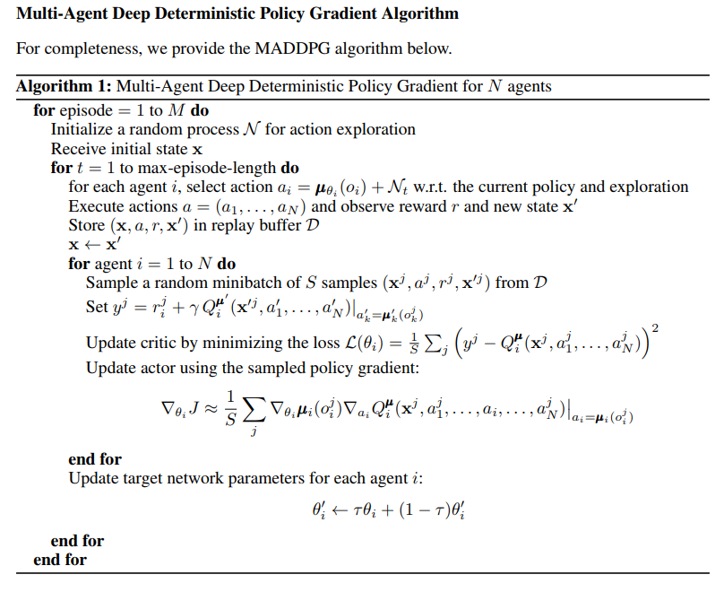

# Multi-Agent Collaboration Project Report

TODO: Decide if using normalisation layers or not (model.py)

## Framework description

* **DDPG**: DDPG or Deep Deterministic Policy Gradients is a model independent and off-policy actor-critic algorithm that uses deep neural networks to learn policies in high-dimensional, continuous action and state spaces. It consists of two networks. The Actor network is a policy based model that will take the state as input and directly output a policy, as in the optimal stochastic action probability distribution associated to that state. The Critic model is a value based model that has a similar structure to the **DQN framework** it will take the state as input and construct a Q valued function for the action space for that state. In order to deal with instability or divergence of the network weights, this framework is supported by the concepts of **Experience replay** and **Fixed Q-Targets** (by using a local and target network) developed by DeepMind.
* **MADDPG**: MADDPG or Multi Agent Deep Deterministic Policy Gradients is an implementation of the DDPG algorithm that is more suited to multi-agent systems. In incorporates a centralised learning structure (as seen in Figure 1) such that all of the Observation and Action spaces are available to the Neural Network during training in order to construct the Q-table (Critic network) and policy (Actor network). However each agent gets its own trained Actor and Critic networks, which allows for decentralised execution. In addition, this implementation introduces the concepts of **Exploration rate** and **Weight savings checks** in order to maximise the training performance.
* **OU Noise**: OU Noise, or Ornstein-Uhlenbeck Noise refers to the introduction of a Gaussian noise when picking an action in the continuous action space during the training of the agent. In practice, this introduced randomness in the action choice has been seen to improve the learning rate of the agent.
* **Exploration rate**: The exploration rate parameter epsilon is first introduced with classical reinforcement learning, and implemented within the **DQN framework** developed by DeepMind. Here, it is reintroduced as a way to scale the amount of **OU Noise** applied to the selected actions. This allow for the agents to start learning by exploring their environment. Epsilon starts off very large, which introduces a lot of noise in the actions taken by the agents. Epsilon then monotonously decreases to 0, where no noise is applied to the action space anymore, after a certain amount of episode that is defined as an hyperparameter.
* **Weight savings checks**: It will be shown in the next sections that this framework is rather unstable and that performance starts to break down after a certain number of episodes. To counteract this and still achieve the best possible performance after learning, a check is introduced that will only save network weights that achieve the highest moving average. Once the performance start to degrade, the weights will not be saved any longer.

<ins>Figure 1: MADDPG structure.</ins>

 

<ins>Figure 2: MADDPG algorithm.</ins>

 

## Implementation structure

The project is structured as follows:

* model.py : this file defines the model classes that contain the deep learning models' structures used to train the agents. It consists of 1 fully connected layer followed by a normalisation layer and then 2 fully connected layers. Apart from the normalised layer, it has the same structure as the one used to solve the OpenAI gym Pendulum environment.
* maddpg_agent.py : this file defines the agent class that contains the functions used to train the agent.
* .ipynb files : Those files set up the environment and allow to train and watch the trained agents perform.
* .pth files: Those files saved the deep learning model weights in order to use a trained agent at any time without the need to retrain.
    
## Hyperparameters

Two different sets of hyperparameters were used to train the agents. They are reported in Table 1 and 2 below. The next section will compare the difference in performance between the two sets of parameters. The parameters in bold are the one that were changed from the previous set.

<ins>Table 1: Training parameters set 1.</ins>

  | Hyperparameter                      | Value |
  | ----------------------------------- | ----- |
  | Number of episodes                  | 2000  |
  | Average score to finish training    | 0.5   |
  | Max timesteps                       | 1000  |
  | Replay Buffer size                  | 1e5   |
  | Batch size                          | 128   |
  | Gamma                               | 0.99  |
  | Tau                                 | 8e-3  |
  | Learning rate Actor                 | 1e-3  |
  | Learning rate Critic                | 1e-3  |
  | Weight decay                     	| 0     |
  | Actor: fc1 size       		| 256   |
  | Actor: fc2 size       		| 128   |
  | Critic: fc1 size       		| 256   |
  | Critic: fc2 size       		| 128   |
  | Mu ou                               | 0     |
  | Theta ou                            | 0.15  |
  | Sigma ou                            | 0.2   |
  | Learn every t                       | 1  	|
  | Learn num                           | 5	|
  | Epsilon start                       | 5.0  	|
  | Epsilon final                       | 0.0	|
  | Episode for epsilon final           | 300  	|

<ins>Table 2: Training parameters set 2.</ins>

  | Hyperparameter                      | Value |
  | ----------------------------------- | ----- |
  | Number of episodes                  | 2000  |
  | Average score to finish training    | 0.5   |
  | Max timesteps                       | 1000  |
  | Replay Buffer size                  | 1e5   |
  | Batch size                          | 128   |
  | Gamma                               | 0.99  |
  | **Tau**                             | 8e-2  |
  | Learning rate Actor                 | 1e-3  |
  | Learning rate Critic                | 1e-3  |
  | Weight decay                     	| 0     |
  | Actor: fc1 size       		| 256   |
  | Actor: fc2 size       		| 128   |
  | Critic: fc1 size       		| 256   |
  | Critic: fc2 size       		| 128   |
  | Mu ou                               | 0     |
  | Theta ou                            | 0.15  |
  | Sigma ou                            | 0.2   |
  | Learn every t                       | 1  	|
  | Learn num                           | 5	|
  | **Epsilon start**                   | 6.0  	|
  | Epsilon final                       | 0.0	|
  | Episode for epsilon final           | 220  	|

The training will stop when the maximum number of episodes is reached. The training is considered successful when the average score reaches 0.5.

## Results and Discussion

<ins>Table 3: Training performance for different sets of hyperparameters.</ins>

| Hyperparameters set 1                                        | Hyperparameters set 2                         |
| ------------------------------------------ | ---------------------------------- |
|               |       |

TODO: 

<ins>Table 4: Execution performance for different sets of hyperparameters.</ins>

| Hyperparameters set 1                                        | Hyperparameters set 2                         |
| ------------------------------------------ | ---------------------------------- |
|               |       |

## Further improvements

TODO: Prioritized experience replay (env where some experiences (i.e. touching the ball, are a lot more valuable and rate than others)
TODO: Stability (systematically explore all sets of hyperparameter to find set that reduces or eliminates instability)
